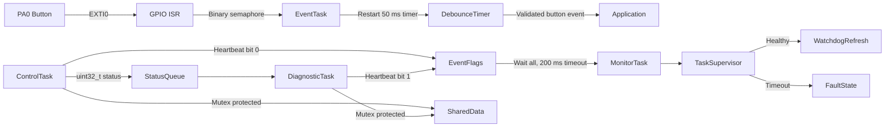

# STM32 FreeRTOS Reliability Practice

A reliability-focused STM32F103 firmware project demonstrating task scheduling,
inter-task communication, interrupt deferral, synchronization, health monitoring,
memory diagnostics, and host-based unit testing.

## System architecture


## Main components
| Component | Responsibility |
|---|---|
| ControlTask | Periodic 10 ms control producer |
| DiagnosticTask | 100 ms queue consumer and diagnostic processing |
| EventTask | Deferred GPIO interrupt processing |
| MonitorTask | Heartbeat supervision and stack monitoring |
| Task Supervisor | HAL/RTOS-independent health state logic |
| Status Queue | Transfers status values between tasks |
| System Event Flags | Synchronizes Control and Diagnostic heartbeats |
| System Data Mutex | Protects shared data from race conditions |
| Debounce Timer | Validates button state after a 50 ms delay |

## Project structure

```text
RTOS_Practice_F103/
├── Core/
│   ├── Inc/
│   │   └── task_supervisor.h
│   └── Src/
│       ├── main.c
│       ├── freertos.c
│       ├── stm32f1xx_it.c
│       └── task_supervisor.c
├── Middlewares/
├── Drivers/
├── tests/
│   └── test_task_supervisor.c
├── TASK_SUPERVISOR_REQUIREMENTS.md
└── RTOS_Practice_F103.ioc
```

## RTOS configuration

| Item | Configuration |
|---|---|
| RTOS interface | CMSIS-RTOS2 |
| Kernel tick | 1 kHz |
| HAL timebase | TIM2 |
| ControlTask period | 10 ms |
| DiagnosticTask period | 100 ms |
| Monitor timeout | 200 ms |
| Button debounce | 50 ms one-shot timer |
| FreeRTOS heap | 8192 bytes |
| Stack overflow checking | Option 2 |

## Reliability mechanisms

- Bounded queue operations with overflow diagnostics.
- Mutex-protected shared data.
- Deferred GPIO interrupt processing using a binary semaphore.
- Task heartbeat supervision using event flags.
- Software watchdog decision logic.
- RTOS object allocation checks before scheduler startup.
- Per-task stack high-water monitoring.
- Stack overflow and allocation-failure hooks.
- HardFault status register capture.
- Integer divide-by-zero and unaligned-access traps.
- Saturating diagnostic counters.

## Build firmware

Open `RTOS_Practice_F103.ioc` and generate code for STM32CubeIDE, then build the
`Debug` configuration.

Expected result:

```text
0 errors, 0 warnings
```

## Run host unit tests

From Windows Terminal with WSL:

```bash
wsl bash -lc "cd /mnt/e/stm32/RTOS_Practice_F103 && gcc -std=c11 -Wall -Wextra -Werror -ICore/Inc tests/test_task_supervisor.c Core/Src/task_supervisor.c -o /tmp/task_supervisor_test && /tmp/task_supervisor_test"
```

Expected result:

```text
TASK SUPERVISOR TEST: PASS
```

## Requirements and tests

Task Supervisor requirements and test traceability are documented in
[TASK_SUPERVISOR_REQUIREMENTS.md](TASK_SUPERVISOR_REQUIREMENTS.md).

## Verification status

- STM32 firmware compilation: passed.
- Host unit tests: passed.
- Requirement traceability: complete for Task Supervisor.
- On-target execution and timing validation: pending hardware availability.

## Target

- MCU: STM32F103RBTx
- IDE: STM32CubeIDE
- Configuration tool: STM32CubeMX
- RTOS API: CMSIS-RTOS2